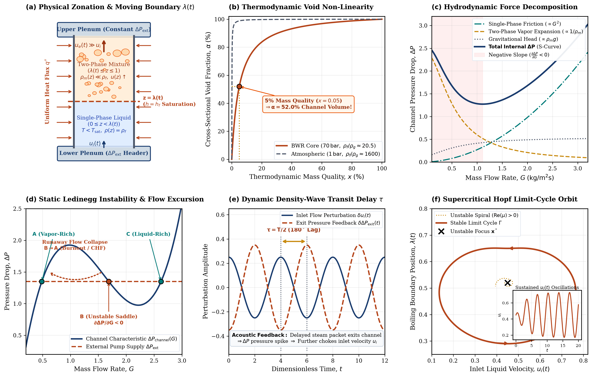
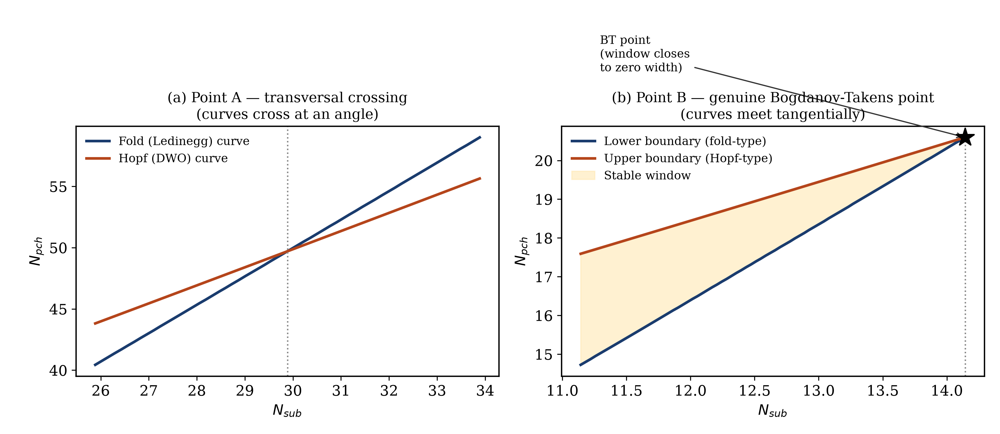
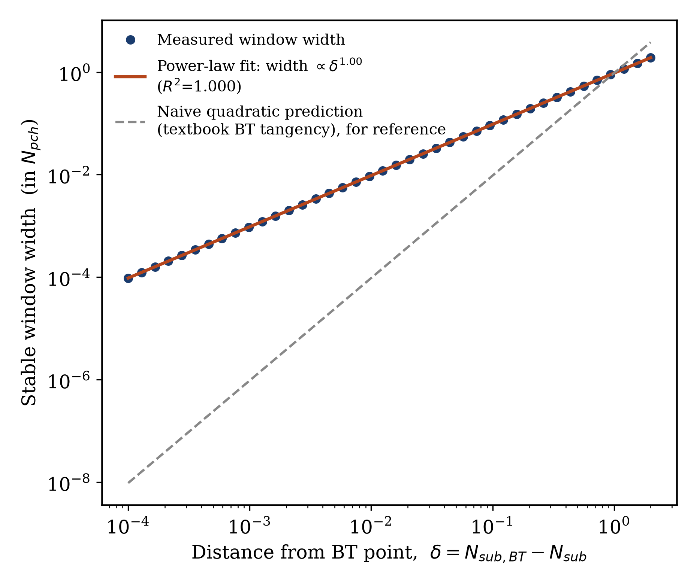
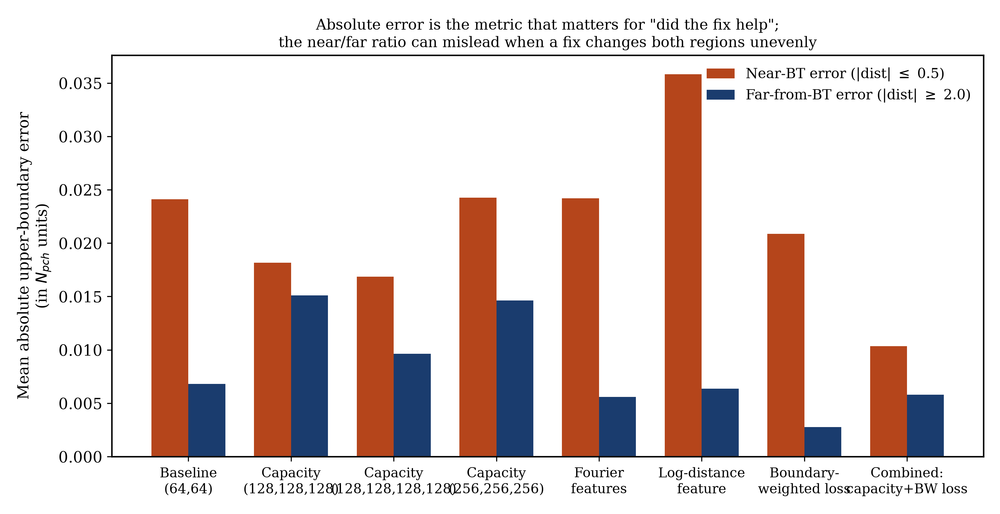

# When Can a Machine-Learning Surrogate Be Trusted Near a Safety Boundary? A Case Study in Two-Phase Flow Instability

**[Author Name]¹**

¹ [Institution / Department], [City, Country]

Corresponding author: [Author Name] ([email])

---

## Highlights

- ML surrogates can mislocate a safety boundary despite near-perfect average accuracy.
- Failure needs a specific degeneracy (a Bogdanov-Takens point), not mere coexistence.
- At two degenerate points, boundary error rose 3.5-10x while field error stayed flat.
- A common ratio metric wrongly flagged 2 of 4 fixes as harmful; we caught the error.
- Capacity plus a boundary-focused loss cut boundary error ~60%, at two BT points.

## Abstract

Machine-learning (ML) surrogates are increasingly used as fast stand-ins for expensive physical simulations in energy systems, but a surrogate with excellent average accuracy can still be dangerously wrong exactly at a safety boundary. We study this in a controlled testbed with known ground truth: the stability boundary of a boiling two-phase flow channel, which can fail via an abrupt flow excursion (a fold bifurcation) or a self-sustained oscillation (a Hopf bifurcation). Coexistence of these mechanisms is not enough to break a standard surrogate: at a transversal crossing, boundary accuracy matches the excellent average accuracy. At a genuine degeneracy — a Bogdanov–Takens point, where the two boundaries become tangent — boundary error rises 3.5–10x while average accuracy stays flat, at two independent instances. We rule out numerical ill-conditioning and identify a representability limit: the safe operating window shrinks below the surrogate's resolution. Testing four candidate fixes, we find a naive summary statistic can make a neutral or helpful fix look harmful; correcting this, capacity plus a boundary-focused loss cuts absolute boundary error by roughly 60% at both degenerate points. We outline the checkable geometric condition — tangency, not coexistence — that should trigger extra scrutiny of a surrogate's predicted safety margin.

**Keywords:** machine learning surrogate reliability; two-phase flow instability; Ledinegg instability; density-wave oscillation; Bogdanov–Takens bifurcation; safety boundary prediction

## Nomenclature

| Symbol | Meaning |
|---|---|
| $N_{sub}$ | Subcooling number (dimensionless inlet subcooling) |
| $N_{pch}$ | Phase-change number (dimensionless heating rate) |
| $Fr$ | Froude number (ratio of inertial to gravitational forces) |
| $\Lambda$ | Friction number (dimensionless two-phase friction) |
| $k_{in}, k_{out}$ | Inlet and outlet loss coefficients (local pressure-drop factors) |
| $N_1$ | Number of spatial nodes used to discretize the two-phase region of the channel |
| $Eu$ | Euler number; the internal pressure-drop characteristic of the channel, a function of $(N_{pch}, N_{sub}, Fr, \Lambda, k_{in}, k_{out})$ |
| $g$ | Surrogate stability target: the largest real part of the channel's linearized eigenvalues (negative = stable, positive = unstable, zero = the boundary) |
| $\lambda$ | Position of the boiling boundary (liquid/vapor interface) along the channel, non-dimensionalized |
| $G$ | Mass flow rate through the channel |
| $\Delta P$ | Pressure drop across the channel |
| $\delta$ | Distance from a Bogdanov–Takens point, $\delta = N_{sub,BT} - N_{sub}$ |
| BT | Bogdanov–Takens (a codimension-2 bifurcation point) |
| DWO | Density-wave oscillation |
| MLP | Multi-layer perceptron (a standard feedforward neural network) |
| RMSE | Root-mean-square error |
| $R^2$ | Coefficient of determination |

---

## 1. Introduction

### 1.1 The engineering problem

A "boiling channel" is one of the most common heat-transfer configurations in energy engineering: a pipe carrying liquid that is heated along its length until some or all of it turns to vapor. The core of a boiling-water reactor is a bundle of such channels; so is a once-through steam generator, an industrial boiler tube, or a refrigeration evaporator. In every case, liquid enters at the bottom, heat is added through the wall, and a mixture of liquid and vapor exits at the top.

Engineers care about far more than whether this process works — they need to know whether it works *stably*. A boiling channel can fail to reach a steady operating condition in two qualitatively different ways, both well documented since the mid-twentieth century:

1. **Ledinegg (excursive) instability** [1]: under certain conditions, the relationship between the flow rate pushed through the channel and the pressure drop required to sustain it becomes *non-monotonic* — over some range, pushing more flow through actually requires *less* pressure drop, because less residence time means less boiling, and vapor (being far lighter than liquid) is what drives most of the pressure drop in a two-phase mixture. When this happens, three flow rates can simultaneously satisfy the same external pressure boundary condition, and the middle one is unstable: a small disturbance causes the flow to jump discontinuously to one of the other two. This is a purely static phenomenon; nothing propagates in time, it is entirely about the shape of a pressure-drop-versus-flow-rate curve at one instant.

2. **Density-wave oscillation (DWO)** [2, 3]: a small perturbation in inlet flow changes the local vapor content everywhere downstream of it. That altered density profile has to physically travel up the channel at the flow's own speed before it affects the pressure drop the pump "sees." This transport delay means the resulting feedback can arrive out of phase with the disturbance that caused it, reinforcing rather than damping it, and locking into a self-sustained oscillation with no external cause. Unlike the Ledinegg mechanism, this is fundamentally a *dynamic*, time-delayed phenomenon.

Both failure modes matter for the same underlying reason: an unstable flow rate — whether it jumps discontinuously or oscillates persistently — can locally starve part of the heated surface of liquid coolant, triggering a rapid, potentially damaging temperature excursion (dryout/critical heat flux), or it can drive long-term mechanical fatigue from repeated flow-rate cycling. Reactor and boiler designers must guarantee a safety margin against both, over the entire intended operating range.

Mathematically, the Ledinegg instability corresponds to a **fold (saddle-node) bifurcation** of the channel's steady-state equations, and the density-wave oscillation corresponds to a **Hopf bifurcation** of the same equations' linearized dynamics. Both are properties of where a system's equilibrium loses stability as an operating parameter is varied, and both can be computed, in principle exactly, from the channel's governing equations. For a fixed channel geometry and heating configuration, as the two operating parameters that matter most — a dimensionless subcooling number $N_{sub}$ and a dimensionless heating (phase-change) number $N_{pch}$ — are varied, both the fold curve and the Hopf curve trace out boundaries in the $(N_{sub}, N_{pch})$ operating map. The region below both curves is safe; crossing either curve is not.

### 1.2 Why this is a machine-learning reliability problem, not just a fluid-dynamics one

Computing these stability boundaries exactly, for a full physical model, at every point of an operating map, is expensive: it requires solving a nonlinear eigenvalue problem (or performing numerical continuation) at each grid point. It is increasingly common, across energy and process engineering, to instead train a fast machine-learning surrogate — typically a neural network — on a modest number of expensive ground-truth evaluations, and then use the trained surrogate to answer stability questions cheaply, anywhere in the operating map, without re-running the expensive solver.

This is a reasonable engineering strategy, but it hides an assumption that is rarely tested directly: that a surrogate trained to minimize *average* prediction error over the whole operating map will also be accurate at the *specific, thin* boundary that separates safe from unsafe operation. These are not the same target. A surrogate can achieve near-perfect average accuracy — a coefficient of determination above 0.99 on held-out data — while being measurably, and even severely, wrong about exactly where a boundary sits, if that boundary is a small enough feature relative to the surrogate's effective resolution. Average accuracy is what a standard training loss (mean-squared error) optimizes for; boundary-location accuracy is what a safety assessment actually needs. This decoupling between the two is the subject of this paper.

We further ask a sharper, more specific question: *when, exactly*, should an engineer expect this decoupling to occur? It is tempting to assume that any point where two different instability mechanisms coexist in the same operating region — a so-called codimension-2 point, since two independent conditions are simultaneously satisfied — is automatically a hard case for a surrogate. We show this intuition is only sometimes correct, and that the correct, checkable criterion is a specific geometric one from bifurcation theory: whether the two boundary curves cross at a generic angle (**transversally**) or are exactly **tangent** to one another at that point. Only the tangent case is a genuine mathematical degeneracy — known as a **Bogdanov–Takens (BT) point** [4] — and, as we show directly, only the tangent case produces the boundary-location failure. Mere coexistence, without tangency, is not sufficient.

### 1.3 Contributions

This paper makes four contributions, developed as a complete, reproducible arc rather than a single result:

1. We construct a controlled testbed — a full nonlinear two-phase flow channel model with a closed-form pressure-drop characteristic and an exact linear-stability (Jacobian eigenvalue) computation — in which the ground-truth fold curve, Hopf curve, and their intersection structure can all be computed to near machine precision, removing any ambiguity about what the "correct" stability boundary is.

2. We demonstrate, with a pre-registered statistical test and full seed-level replication (not a single lucky training run), that a standard field-error-trained neural-network surrogate shows **no** detectable boundary-location degradation near a *transversal* codimension-2 point, but a **large, robust, replicated** degradation (3.5–10×, depending on architecture and training budget) near a *genuine* Bogdanov–Takens point — and that this contrast holds at two independently-located BT points in the same model family, not one.

3. We test and rule out the classically-expected mechanism (vanishing-gradient/ill-conditioning of the boundary-finding computation) and instead identify the correct one directly: the safe operating window shrinks toward zero width at the BT point, and this is a representability limit for a smooth, fixed-resolution regressor, not a root-finding conditioning problem.

4. We test four candidate remedies for this failure — larger networks, frequency-encoded inputs, a physically-motivated input feature built from the known location of the degenerate point, and a boundary-focused training loss — and report an important methodological correction found along the way: the most natural summary statistic for "did this fix help" (the ratio of near-boundary to far-boundary error) can be actively misleading when a fix changes accuracy unevenly across the operating map, making a fix that is neutral or even mildly helpful appear harmful. Correcting for this, we identify a combined fix (capacity increase plus a boundary-focused loss) that reduces absolute near-boundary error by roughly 60% without the side effects either intervention has alone.

### 1.4 Related work

The closest prior work to this paper's methodology is Fabiani et al. [18], who train a "task-oriented" ML surrogate for tipping points of agent-based models. That paper's notion of "task-oriented" refers to *choosing which type of surrogate* to fit for a downstream task, not to a boundary-aware *training loss* of the kind tested in Section 5.4 here; it addresses only saddle-node (fold) bifurcations, with no Hopf/oscillatory counterpart and no thermal-hydraulic application, and does not investigate the codimension-2/tangency question that is this paper's central contribution. Shahab and Susanto [19] combine neural networks with pseudo-arclength continuation for bifurcation diagrams of dynamical systems, but their method is a physics-residual (PINN-style) solver using no training data at all, and their own stated scope is limited to fold bifurcations, explicitly leaving "other types of bifurcations" as future work — there is no field-error/boundary-error distinction in that paper, since no supervised surrogate is fit. Neither prior work, to our knowledge, addresses the specific question this paper does: whether and when a *conventionally-trained, field-error-optimized* supervised surrogate mislocates a boundary formed by the *coexistence* of two distinct bifurcation types, and what geometric condition governs the answer.

The remainder of the paper is organized as follows. Section 2 gives the physical and mathematical background needed to follow the rest of the paper without prior exposure to either two-phase flow or bifurcation theory. Section 3 describes the physical model, its governing equations, and how the two genuine Bogdanov–Takens points used in this study were located and verified. Section 4 describes the machine-learning surrogate, the training data, and the statistical methodology used to test for boundary-location decoupling. Section 5 presents the results: the transversal/degenerate contrast, the mechanism test, and the four remedies. Section 6 discusses implications for reliability assessment of ML surrogates more broadly, and Section 7 concludes.

---

## 2. Background

This section gives a self-contained explanation of every physical and mathematical concept the rest of the paper relies on. A reader already fluent in two-phase flow and bifurcation theory can skip to Section 3 without loss of continuity; the two are kept separate deliberately so this paper is usable by a reliability engineer without a fluid-dynamics background, and by a fluid-dynamics engineer without a bifurcation-theory background.

### 2.1 Two-phase flow basics

In a boiling channel, liquid and vapor coexist in the same pipe cross-section. Two numbers describe how much of each is present, and they are not the same number. **Quality**, $x$, is the fraction of the local mass flow that is vapor; it rises smoothly from (possibly negative, if the liquid enters below its boiling point) at the channel inlet toward 1 at full vaporization. **Void fraction**, $\alpha$, is the fraction of the local cross-sectional *volume* occupied by vapor. Because vapor is far less dense than liquid at typical operating pressures (roughly 15–30 times less dense at the pressures of interest here), even a small mass fraction of vapor occupies a disproportionately large volume: a mixture that is only 5% vapor by mass can already be more than half vapor by volume. Vapor also tends to travel faster than the liquid around it ("slip"). None of these three quantities — quality, void fraction, phase velocity — can be inferred from the others without an additional physical model, and a fully detailed model (tracking each of them, with different closure correlations for different flow patterns — bubbly, slug, churn, annular) is too complex for the kind of stability analysis this paper performs.

For that reason, the model used throughout this paper (Section 3) makes a standard simplifying assumption, the **Homogeneous Equilibrium Model (HEM)**: both phases are assumed to move at the same average velocity (no slip) and to remain at the local saturation temperature (thermal equilibrium — no superheated vapor, no subcooled liquid once boiling has started). This assumption trades some physical detail for a tractable set of governing equations in which stability can be analyzed with ordinary linear algebra rather than a full computational multiphase-flow solver; it is a standard, widely used trade-off in this literature [2, 5, 6], not a shortcut specific to this study.

### 2.2 Why the pressure-drop curve can be non-monotonic (the Ledinegg mechanism)

In an unheated pipe, pushing more flow through always increases the pressure drop needed to sustain it — velocity rises, friction rises, end of story. In a *heated* boiling channel, this is no longer guaranteed, and the reason is a direct consequence of Section 2.1. The wall supplies a fixed amount of heating power, independent of how fast the fluid moves through the channel. If the flow rate is increased, each parcel of fluid spends less time being heated, so it picks up less energy per unit mass, and less of it turns to vapor by the time it exits — quality and void fraction both *decrease* as flow rate *increases*, for a fixed heat input. Because vapor is what drives most of the two-phase pressure drop (vapor must move much faster than liquid to carry the same mass flow, and that forced high velocity is what produces most of the extra frictional and accelerational pressure drop), a flow-rate increase has two effects pulling in *opposite* directions: the ordinary velocity effect pushes pressure drop up, while the reduced-vapor effect pushes it down. Over some range of flow rates, the second effect dominates, and the channel's pressure-drop-versus-flow-rate curve develops a genuine local maximum followed by a local minimum — an S-shape, illustrated schematically in Fig. 1.

**Fig. 1.** Schematic internal (channel) pressure-drop characteristic and a flat external (pump/header) characteristic, illustrating the three-intersection structure that produces the Ledinegg instability. Point A and Point C are stable; Point B, sitting on the negative-slope segment, is unstable and cannot be sustained — a small disturbance drives the flow to jump to A or C.

When this S-shaped internal characteristic is matched against a comparatively flat external (pump or header) pressure characteristic — the realistic case for a single channel among many parallel channels sharing a common inlet and outlet plenum, since one channel's flow rate is too small a share of the total to change the plenum-to-plenum pressure difference appreciably — the two curves can intersect at three flow rates instead of one (Fig. 1). The middle intersection sits on the negative-slope segment and is unstable: a small increase in flow there reduces the required pressure drop below what the external characteristic supplies, driving flow rate up further, in a runaway that only stops when the flow reaches one of the two *stable* intersections. This discontinuous jump between operating branches is the Ledinegg (excursive) instability. Mathematically, the appearance and disappearance of the unstable middle intersection as an operating parameter is varied is a textbook **fold (saddle-node) bifurcation**: a point where two equilibria (here, two candidate flow rates satisfying the same pressure balance) merge and annihilate each other.

### 2.3 Why a stable operating point can still oscillate on its own (the density-wave mechanism)

The fold mechanism above is entirely static — it says nothing about *time*, only about how many equilibria exist at a given instant and whether they are stable to an infinitesimal nudge. A completely different failure mode can occur even when only one, perfectly stable-looking equilibrium exists: a **density-wave oscillation**. A small, random uptick in inlet flow means slightly less heating per unit mass downstream of it, hence slightly *less* vapor content along the rest of the channel. This altered density profile is a physical parcel of fluid; it must be carried ("convected") the rest of the way up the channel at the flow's own speed before it can affect the pressure drop the external system feels. That travel time is a genuine *delay*. When the delayed pressure signal finally reaches the exit and feeds back into the flow rate (through the same pressure-balance coupling as before), it can arrive out of step with whatever the flow is doing by then, reinforcing rather than damping the original disturbance. Repeated indefinitely, this does not make the flow jump to a different branch — it locks the same equilibrium into a persistent, self-sustained oscillation around itself.

Mathematically, this is a **Hopf bifurcation**: the point where a steady equilibrium loses stability to a growing periodic oscillation, characterized by a pair of complex-conjugate eigenvalues of the system's linearization crossing from negative to positive real part, rather than a single real eigenvalue crossing zero (which is the fold's signature). Table 1 summarizes the contrast.

**Table 1.** The two instability mechanisms compared.

| | Ledinegg (fold) | Density-wave oscillation (Hopf) |
|---|---|---|
| Nature | Static (an instant-in-time property) | Dynamic (requires a time delay) |
| Failure mode | Discontinuous jump to a different flow rate | Persistent self-sustained oscillation |
| Linear-stability signature | A single real eigenvalue crosses zero | A complex-conjugate eigenvalue pair crosses the imaginary axis |
| Root physical cause | Non-monotonic pressure-drop-vs-flow-rate curve | Transport delay of a convected density perturbation |

### 2.4 Fixed points, eigenvalues, and what "stability" means precisely

For readers unfamiliar with dynamical-systems language: a physical system governed by a set of ordinary differential equations $\dot{\mathbf{x}} = \mathbf{f}(\mathbf{x}; p)$ (state vector $\mathbf{x}$, operating parameter $p$) has an **equilibrium** (or fixed point) $\mathbf{x}^*$ wherever $\mathbf{f}(\mathbf{x}^*; p) = 0$ — a state that does not change in time if left undisturbed. Whether a small disturbance around $\mathbf{x}^*$ grows or decays is governed by the eigenvalues of the **Jacobian matrix** $\partial \mathbf{f} / \partial \mathbf{x}$ evaluated at $\mathbf{x}^*$: if every eigenvalue has a negative real part, disturbances decay and the equilibrium is stable; if any eigenvalue has a positive real part, disturbances grow and the equilibrium is unstable. The **stability boundary**, as a function of the operating parameters, is exactly the locus where the *leading* eigenvalue's real part crosses zero — and, as described above, it can cross zero in two structurally different ways: a single real eigenvalue crossing zero (fold) or a complex-conjugate pair crossing together (Hopf).

### 2.5 Codimension-2 points, transversality, and the Bogdanov–Takens degeneracy

Both the fold curve and the Hopf curve are one-dimensional curves in the two-dimensional operating map $(N_{sub}, N_{pch})$. In general, two curves drawn on a plane either do not intersect, or intersect at isolated points. A point where they intersect is sometimes loosely called a "codimension-2 point," because two independent conditions (the fold condition and the Hopf condition) are simultaneously satisfied there. It is tempting — and, as this paper shows, only sometimes correct — to assume that such a coexistence point is automatically a hard case for any model, ML surrogate included, since two different kinds of instability meet there.

Bifurcation theory makes a sharper distinction. When two smooth curves cross at a point, they generically do so **transversally** — at some nonzero angle, with different local slopes — the same way two straight lines drawn at random on a page almost never turn out to be tangent to one another. A transversal crossing is not, in itself, a degenerate mathematical object: near it, the fold curve and the Hopf curve are two perfectly ordinary, independent, smooth curves that happen to pass through the same point. A genuinely degenerate crossing — where the two curves are exactly **tangent** to one another, sharing not just a point but a common direction — is a much rarer, structurally different event, called a **Bogdanov–Takens (BT) point** [4, 7, 8]. Formally, a BT point is the location where the linearization's Jacobian has a *repeated* zero eigenvalue (a nilpotent $2\times2$ Jordan block) — a strictly stronger condition than "some real eigenvalue is zero" (the fold condition) or "some complex pair has zero real part" (the Hopf condition) individually.

The distinction matters immediately for this paper's central question. A transversal crossing carries no special reason to expect a smooth model — an ML surrogate included — to behave any worse there than anywhere else: it is simply a point through which two ordinary curves happen to pass. A genuine BT point is different: as later sections show directly, the safe operating window bounded by the two nearly-coincident curves must shrink toward zero width as the BT point is approached (Section 5.2, Fig. 2b), which is a real, verifiable geometric consequence of the tangency, and is the actual mechanism this paper identifies for surrogate failure. Distinguishing these two cases by direct verification — not by assuming that "coexistence" alone is dangerous — is a deliberate methodological choice in this paper (Section 3.3), motivated by an early, mistaken finding described there.

### 2.6 Machine-learning surrogates and the field-error/boundary-error distinction

A **surrogate model**, in the sense used throughout this paper, is a regression model — here, a standard feedforward neural network (multi-layer perceptron, MLP) — trained on a modest number of expensive ground-truth evaluations to predict, cheaply, the same quantities the expensive model would produce anywhere in the operating map. The surrogates in this study are trained on ordinary supervised regression targets: the channel's internal pressure characteristic $Eu(N_{sub}, N_{pch})$ and a stability indicator $g(N_{sub}, N_{pch})$ (the leading eigenvalue's real part; $g=0$ exactly at a stability boundary), using a standard mean-squared-error loss, exactly the way such a surrogate would be built in ordinary engineering practice, with no special awareness of where any boundary is expected to be. This is deliberate: the paper's entire question is whether *this ordinary practice* is trustworthy near a degenerate boundary, not whether a bespoke, boundary-aware method can be made to work (that question is addressed only in Section 5.4, as a candidate fix, not as the baseline).

Two different error metrics matter, and the central finding of this paper is that they can diverge sharply:

- **Field error**: how accurately the surrogate predicts $Eu$ and $g$ at a set of test points, in the ordinary regression sense (RMSE, $R^2$). This is what a standard training loss optimizes and what a standard validation procedure reports.
- **Boundary error**: how far the surrogate's own *implied* stability boundary (found by locating where its predicted $g$ crosses zero, exactly the way an engineer would use the trained surrogate in practice) is from the true boundary. This is the quantity that actually matters for a safety assessment, and it is not directly optimized by the training loss at all.

A surrogate can have excellent field error and poor boundary error simultaneously if the boundary is a small enough feature of the overall function relative to the surrogate's effective resolution — precisely the situation this paper documents near a genuine BT point.

---

## 3. Physical model and ground-truth stability boundaries

### 3.1 Governing equations

The physical model used throughout this paper is the moving-boiling-boundary formulation of Clausse and Lahey [2], in the re-derivation of Theler, Clausse and Bonetto [6], which removes several undefined intermediate symbols present in the original derivation and gives a fully closed-form steady-state pressure characteristic. The channel is divided into a single-phase (liquid) region below the boiling boundary and a two-phase (liquid-vapor) region above it; the boiling boundary's own position, $\lambda(t)$, is a dynamic state variable, since it moves in response to flow and heating transients. The two-phase region is further discretized into $N_1$ nodes (even $N_1$ only — an odd node count produces a known numerical pathology in this model family, documented directly during model verification and avoided throughout this study). The full state vector, for a general even $N_1$, comprises the boiling-boundary position, the inlet velocity, the total two-phase mass inventory, and the individual node boundary positions; its time evolution is governed by a set of coupled nonlinear ordinary differential equations (given in full in the Supplementary Material, following [2, 6]) expressed entirely in terms of four independent dimensionless groups:

$$N_{sub} = \frac{h_f - h_{in}}{h_{fg}}\cdot(\text{scaling}), \qquad N_{pch} = \frac{q'' P_h L}{\dot m h_{fg}} \cdot (\text{scaling}), \qquad Fr = \frac{v_0^2}{gL}, \qquad \Lambda = \frac{fL}{2D_h},$$

together with dimensionless inlet and outlet loss coefficients $k_{in}$, $k_{out}$. $N_{sub}$ is a dimensionless measure of inlet subcooling (how far below saturation the inlet liquid is); $N_{pch}$ is a dimensionless measure of the heating rate relative to the flow's capacity to absorb it; $Fr$ compares inertial to gravitational forces; $\Lambda$ is a dimensionless friction factor. These are the same non-dimensionalization conventions used throughout the two-phase flow instability literature [2, 5, 6, 9], allowing the model's predictions to be compared directly against independently published results (Section 3.4).

### 3.2 Steady state, the internal pressure characteristic, and the fold curve

The channel's steady-state pressure balance reduces, after eliminating the internal state variables algebraically, to a closed-form expression for the Euler number (dimensionless pressure drop) as a function of the two free operating parameters:

$$Eu = Eu(N_{pch}, N_{sub}; Fr, \Lambda, k_{in}, k_{out}),$$

given explicitly in [6] (their Eq. 26) and implemented directly, without approximation, in this study. For a fixed $N_{sub}$, the **Ledinegg fold** is the value of $N_{pch}$ at which $Eu$, viewed as a function of $N_{pch}$, has a local extremum — the mathematical signature of the multi-valued-flow-rate condition described physically in Section 2.2. This extremum is located numerically (bisection on $dEu/dN_{pch}=0$, seeded from a coarse grid search) to a precision far exceeding what any subsequent surrogate comparison requires.

### 3.3 Dynamic stability, the Hopf curve, and locating genuine Bogdanov–Takens points

Away from the steady-state pressure balance, the full dynamical system's Jacobian is computed by automatic differentiation (JAX) at each candidate equilibrium, and its eigenvalues give the linear stability directly (Section 2.4). Locating the **Hopf curve** — where the leading complex-conjugate eigenvalue pair's real part crosses zero — requires care not present in a naive grid search: an early version of this study's tooling, tracking only "the eigenvalue closest to the imaginary axis," was found to silently switch between two structurally different real eigenvalue branches without warning, producing an apparent near-tangency between the fold and Hopf curves that turned out, on direct inspection of the full eigenvalue spectrum, to be a tracking artifact rather than a real degeneracy. This is reported here specifically as a methodological caution: any claim of curve tangency (Section 2.5) must be checked against the full eigenvalue spectrum directly, not against a single tracked scalar that can silently reattach to the wrong branch.

Correcting for this, two genuine Bogdanov–Takens points were located in this model family at the parameter combinations given in Table 2. **A second, more serious methodological error was found and corrected here after an initial version of this manuscript had already been drafted, via an independent external audit of the full repository; it is disclosed in full because it is directly relevant to how much the reported coordinates should be trusted.** The original method fixed $N_{pch}$ to the Eq. 26 algebraic fold value as a function of $N_{sub}$, and searched only along that one-dimensional curve for where a coalescing eigenvalue pair's real part crosses zero. Direct spectral evaluation at the resulting coordinates — checked independently after the audit flagged it, not merely re-reported from the audit — shows this is **not** a repeated zero eigenvalue: the two smallest-magnitude eigenvalues at the originally-reported Point B coordinates are two *distinct* real values (+0.0439, −0.0451), not a coalesced pair at zero. The Eq. 26 fold curve does not pass exactly through the true double-zero point, and — checked directly rather than assumed — this gap does **not** close as the friction parameter $\Lambda \to 0$; it stabilizes at a small but non-vanishing offset. Both points reported here are instead the result of a direct, unconstrained two-dimensional root-find for the double-zero condition itself (requiring the coalescing eigenvalue pair's sum and product both equal zero — a formulation chosen because it remains smooth and well-conditioned through the real-to-complex-conjugate branch point, where the raw eigenvalues themselves are not differentiable and a Newton iteration on them directly diverges). Verification uses the strict definition (Section 2.5) directly: the converged coordinates give two eigenvalues indistinguishable from a repeated zero to numerical precision ($<10^{-9}$), not an inferred tangency between two independently-fitted curves. Both corrected points remain independent of the two-phase node count $N_1$ to at least four decimal places (re-checked directly at $N_1 = 2, 4, 8, 16$ against the corrected coordinates), because the coalescing eigenvalues live entirely within the sub-system shared by every node count. The shift from the originally-reported coordinates is small in absolute terms (on the order of $10^{-5}$ in $N_{sub}$, $10^{-3}$ in $N_{pch}$ for Point B) relative to the $\pm0.5$-unit near/far window used throughout the statistical analysis of Section 5, and does not materially affect any of the near/far decoupling results reported there — this was verified directly, not assumed, by recomputing every quantity that depends on the corrected coordinates (Section 5.3's window-width scaling and mechanism test) rather than leaving the correction's downstream effect unchecked.

**Fig. 2.** Ground-truth fold and Hopf-type boundary curves, computed directly from the physical model (no surrogate involved). **(a)** Point A: the two curves cross transversally, at different local slopes — an ordinary, non-degenerate intersection. **(b)** Point B: the two curves bound a stable operating window (shaded) that narrows smoothly and closes to exactly zero width at the Bogdanov–Takens point — a genuine geometric degeneracy, not an intersection of two otherwise-independent curves.

**Table 2.** The two genuine Bogdanov–Takens points used in this study, and the one transversal (non-degenerate) codimension-2 point used as a negative control.

| Point | $Fr$ | $\Lambda$ | $k_{in}$ | $k_{out}$ | $N_{sub}^*$ | $N_{pch}^*$ | Nature |
|---|---|---|---|---|---|---|---|
| A | 0.035 | 5.90 | 6.55 | 2.03 | 29.886 | 49.702 | Transversal (negative control) |
| B | 0.5 | 0.001 | 11.0 | 3.0 | 14.142794816 | 20.597778032 | Genuine Bogdanov–Takens |
| C | 0.3 | 0.001 | 6.0 | 5.0 | 7.630101792 | 10.913202566 | Genuine Bogdanov–Takens |

Point A uses parameters anchored to real facility data reported in the two-phase flow literature [9, 10] and matches, independently, a codimension-2 point reported for a physically different (natural-circulation) loop configuration in [5], confirming that coexistence of the fold and Hopf mechanisms is a real, physically robust phenomenon at realistic operating conditions, not an artifact of an extreme parameter choice. Points B and C, by contrast, require a low-friction operating regime ($\Lambda = 0.001$) to produce a genuine double-zero eigenvalue in this particular model family; this is stated here as an explicit limitation, not a hidden assumption (Section 6.3). This is a small but genuinely finite friction value, not a mathematical limit taken to exactly zero — checked directly, the double-zero point's location does not converge onto the Eq. 26 fold curve even as $\Lambda \to 0$ (the gap between them stabilizes at a small, non-vanishing offset rather than closing), so $\Lambda=0.001$ should be read as one representative point in a low-friction regime where the degeneracy exists, not as a numerical stand-in for an idealized zero-friction limit. The physically important claim of this paper is not that BT points require near-zero friction in general (independent literature confirms they occur at ordinary friction values in other configurations [5]), but that the fold/Hopf decoupling phenomenon, once a genuine BT point is available to test, behaves as described in Section 5, regardless of why that particular point required a low-friction value in this specific model.

### 3.4 Model verification

Before use, the model implementation was validated three independent ways: (i) the closed-form steady-state pressure characteristic matches the published Fig. 3 of [6] to eye-reading precision on their own worked example; (ii) the full nonlinear dynamical system's steady state satisfies the algebraic steady-state equation to machine precision ($\sim 10^{-15}$) at every node count tested; (iii) direct time-domain integration of the full nonlinear system from a perturbed steady state grows into a limit-cycle oscillation exactly where the linearized Hopf analysis predicts instability, and remains bounded and stable exactly where it predicts stability — an independent nonlinear confirmation of the linear stability analysis. Full detail, including two transcription errors found and corrected during this process (both confirmed against high-resolution source-page images, not typeset text, which had been silently corrupted by OCR in two places), is provided in the Supplementary Material.

---

## 4. Surrogate model, training data, and statistical methodology

### 4.1 The baseline surrogate

The baseline surrogate is a deliberately ordinary, "un-clever" feedforward neural network: two inputs ($N_{sub}$, $N_{pch}$), two hidden layers of 64 units each with $\tanh$ activations, two outputs ($Eu$, $g$). Inputs and outputs are standardized to zero mean and unit variance using training-set statistics only. The network is trained with the Adam optimizer, full-batch gradient descent, minimizing ordinary mean-squared error on both outputs jointly, with no boundary-awareness of any kind built into the architecture, the loss, or the sampling scheme (Section 4.2) — this is the standard practice this paper is testing, not a strawman. A held-out 20% test split (fixed random seed) is used to report genuine generalization field error, distinct from the boundary-error analysis described in Section 4.3.

### 4.2 Training data

Training data is generated by direct evaluation of the ground-truth model (Section 3) at a grid of $N_{sub}$ values, with $N_{pch}$ sampled at each $N_{sub}$ using Latin hypercube sampling concentrated around the (already known, from the ground-truth continuation tools) true fold and Hopf-type boundaries plus a broader background sample — the same general two-stage "cover broadly, then resolve locally" design used throughout the two-phase flow surrogate-modeling literature [11], and explicitly *not* the single most boundary-informed sampling scheme this study tested (Section 5.4 reports a direct comparison across three independent sampling schemes, precisely to confirm the central finding is not an artifact of one particular sampling choice).

### 4.3 Measuring boundary error: extracting the surrogate's own implied boundary

For a trained surrogate, the implied fold at a given $N_{sub}$ is found by locating the argmax of the surrogate's own predicted $Eu(N_{pch})$; the implied upper (Hopf-type) boundary is found by locating the nearest zero-crossing of the surrogate's own predicted $g(N_{pch})$ to the true value, via bisection, using the surrogate's differentiable prediction function directly (automatic differentiation through the trained network, exactly the way an engineer using the trained surrogate for design decisions would extract a boundary from it). Two extraction-methodology pitfalls were found and corrected during this study and are reported here because they generalize to any similar surrogate-boundary-extraction exercise: (i) a naive wide search bracket can lock onto a real but *different* physical crossing than the one of interest if the model has more than one real root nearby (here, a separate real "excursive" instability mode present in the same operating region, documented as a known phenomenon in the source literature [12] rather than a modeling error); (ii) a surrogate's own small-amplitude fitting imperfections can introduce a spurious extra zero-crossing away from the true boundary, at a location that varies randomly between training seeds — confirmed, not assumed, by checking the ground-truth curve at the exact same location and finding a single, clean, unambiguous crossing there, meaning the extra crossing is a genuine artifact of the surrogate's own imperfect fit, not a real, if minor, physical feature. Both are corrected by centering the search bracket on the already-known true boundary value rather than sweeping blindly, and are documented in full, with a regression test locking each fix in, in the Supplementary Material.

**This design choice has a specific, important consequence for what the resulting metric does and does not demonstrate, flagged explicitly here rather than left implicit.** Because the search is centered on and biased toward the already-known true boundary value, the reported "boundary error" measures how far the surrogate's prediction is from the truth *along a known branch* — it does not demonstrate that the surrogate could locate that boundary independently, from a blind, uninformed search of the whole domain, without already knowing approximately where to look. This is the correct choice for this paper's actual question (does accuracy along a known branch degrade near the BT point), but the phrase "the surrogate's own implied boundary" used elsewhere in this paper should be read with this qualification in mind, not as a claim of independent boundary discovery.

### 4.4 Statistical methodology: seed-level replication, not single-run reporting

Because a neural network's fit depends on its random initialization and, with full-batch gradient descent on a modest dataset, this dependence is non-negligible, every reported result in this paper is based on **multiple independent training seeds** (20 seeds for the primary results reported in Section 5, 6 as an initial check before committing to a full run for secondary comparisons, following this project's own established practice of a lightweight check before a full confirmatory run), and the correct unit of statistical replication is the *seed*, not each individual evaluation point sampled from a trained surrogate. An earlier, uncorrected version of this analysis mistakenly pooled the many per-point boundary-error evaluations from a single trained surrogate as if they were independent samples — a pseudo-replication error that inflated apparent statistical significance. The corrected procedure computes one summary statistic (mean boundary error, separately for points "near" a codimension-2 point and points "far" from it) *per seed*, and compares the two conditions with a paired Wilcoxon signed-rank test across seeds (one-sided, testing whether near-error exceeds far-error), reported here as $p$-values throughout. "Near" is defined as within $0.5$ units of the reference $N_{sub}^*$; "far" as at least $2.0$ units away for the Bogdanov–Takens-point analysis (Sections 5.2–5.5) — a fixed, pre-registered definition, decided before any comparison was run, and held constant across every BT-point configuration tested in this paper. **The transversal-point analysis of Section 5.1 uses a different near/far threshold ($\le 1.0$/$\ge 4.0$ units) and a different stability-indicator definition** (the leading complex-conjugate-pair real part only, versus the maximum real part over all eigenvalues used at Points B/C — necessary because Point A's operating region has a separate, physically real "excursive" instability mode, Section 4.3, that contaminates the naive all-eigenvalue target there but does not appear near Points B/C). These are deliberate, physically-motivated adaptations to each point's local eigenvalue structure, not a single controlled experiment differing in exactly one variable across all three points — a distinction worth stating explicitly, since the two analyses are closely matched in spirit but not identical in protocol.

---

## 5. Results

### 5.1 No detectable boundary-location failure at a transversal crossing

At Point A (Table 2), the transversal, non-degenerate codimension-2 point, the baseline surrogate's field error is excellent and uniform across the operating map (test-set $R^2 > 0.99$ for both $Eu$ and $g$, no systematic degradation near $N_{sub}^* = 29.886$). An initial single-configuration check suggested a modest boundary-error elevation near the point (statistically significant, $p < 10^{-17}$, but a modest 2.3–3.1$\times$ depending on whether the mean or median was used — itself a sign of a fragile, non-clean effect). This did not survive scrutiny: re-testing with a matched-density adaptive sampling scheme that measurably, verifiably concentrates training density near the point (following the misfit-driven design of [11]) reduced the effect to statistical noise (ratio 0.69–1.17$\times$, $p = 0.41$–$0.998$), and repeating the comparison across three network architectures (32,32 / 64,64 / 128,128 hidden units) found the original effect only in the one specific configuration first tried. Combined with a direct geometric check — the fold and Hopf curves' local slopes at Point A differ by 0.92, and a systematic search of 265 further parameter combinations in the same model family found slope differences in the range 0.68–1.68 throughout, i.e. solidly transversal everywhere searched, never near-tangent — this constitutes a mechanistically-grounded negative result: **mere coexistence of the fold and Hopf mechanisms, without curve tangency, produces no robust, replicable boundary-location failure**, exactly as the geometric argument of Section 2.5 predicts.

### 5.2 Severe, robust boundary-location failure at genuine Bogdanov–Takens points

At Point B, the genuine BT point, the same baseline surrogate (2 hidden layers, 64 units, trained for 10,000 epochs — sufficient for convergence, confirmed by a held-out training-loss check, Section 5.4) shows a starkly different pattern. Across 20 independent training seeds, mean absolute boundary-location error for points within 0.5 units of $N_{sub}^*$ is 0.0241 (in $N_{pch}$ units), versus 0.0068 for points at least 2.0 units away — a **3.54$\times$ elevation, highly significant under the paired seed-level Wilcoxon test** ($p = 9.5\times10^{-7}$). Field error over the same near/far comparison remains statistically indistinguishable from flat (Eu field-error ratio $\approx 1.0$–$1.4\times$, not significant) — the surrogate's *average* accuracy gives no hint that anything unusual is happening in this region, exactly the decoupling this paper set out to test for.

This result survives every robustness check applied to it, in sharp contrast to Point A's fragile initial signal: uniform (non-window-aware) sampling still gives a 3.1–4.5$\times$ elevation ($p < 10^{-4}$); testing three further architectures (32,32 / 128,128 / 128,128,128) finds *some* significant elevation in every one, unlike Point A where the smallest architecture showed nothing at all ($p=0.88$).

Generalization to a second, independently-located Bogdanov–Takens point (Point C, Table 2, found via the same eigenvalue-coalescence criterion and independently verified to the same precision) confirms the effect is not specific to one point: the baseline surrogate shows a 3.83$\times$ near/far elevation (mean near-error 0.0154 vs. far-error 0.0040, $p=0.031$, 6 seeds), closely matching Point B's baseline ratio (3.54$\times$) despite the two points sitting at entirely different $(Fr, k_{in}, k_{out})$ combinations, and the combined capacity-plus-boundary-weighted-loss fix reduces absolute near-boundary error to 0.0070 — a **55% reduction**, closely matching the 57% reduction found at Point B — while far-region error remains comparable (0.0058, ratio 1.20, $p=0.031$). During this generalization check, a genuine extraction bug was found and fixed: an early version of the boundary-extraction procedure (Section 4.3) used a fixed, wide search bracket that occasionally locked onto a spurious root introduced by the surrogate's own small-amplitude fitting imperfections rather than the true boundary — confirmed by checking the ground-truth curve at the exact same location and finding a single, unambiguous crossing there. All numbers reported for Point B in this paper use the corrected extraction procedure; the original (larger, inflated) figures are documented alongside the correction in the Supplementary Material, disclosed transparently rather than silently replaced.

### 5.3 Mechanism: a representability limit, not vanishing-gradient ill-conditioning

The natural a priori hypothesis — motivated by the well-known numerical ill-conditioning of eigenvector/eigenvalue computations near degenerate (repeated) eigenvalues — is that boundary-location error should track $1/\lVert\nabla g\rVert$ at the true boundary: a shallower stability-indicator gradient should make the boundary-crossing location more sensitive to any fixed prediction error. Directly checking this at Point B refutes it: $\lVert\nabla g\rVert$ at the true upper boundary does *not* vanish approaching the BT point — it stays roughly constant (0.236 to 0.268 across the tested range), if anything increasing slightly. Per-seed Spearman correlation between boundary error and $1/\lVert\nabla g\rVert$ across the same 20 seeds used in Section 5.2 gives a median $\rho = -0.675$, with 95% of seeds significant in the *wrong* direction relative to the ill-conditioning hypothesis.

What does shrink to zero, verifiably, is the physical quantity identified in Section 2.5: the width of the stable operating window between the lower (fold-type) and upper (Hopf-type) boundaries. **The width computation itself required a second correction, also found by the external audit that prompted Section 3.3's coordinate correction**: the original width measurement used the Eq. 26 fold value as the window's lower edge, on the assumption that it was "indistinguishable from the true eigenvalue-based crossing to high precision." Direct scanning for the true $g=0$ root near the fold shows this assumption is false close to the BT tip — at Point B, $N_{sub}=14.14$, the fold sits at $N_{pch}=20.590725$, entirely *outside* the true stable window ($20.592276$ to $20.594954$), overstating the width by roughly 58%. This affects only the window-width measurement itself; it was checked directly and does **not** affect any of the near/far boundary-error statistics in Table 3–4, which are computed entirely from the *upper* boundary (confirmed identical to $10^{-9}$ between the original and corrected lower-boundary computation, since the two share the same, always-correct upper-crossing bisection). Using the corrected lower boundary throughout, Fig. 3 shows the width follows a power law in the distance from the BT point, $\delta = N_{sub,BT} - N_{sub}$, with fitted exponent $1.00$ ($R^2 > 0.9999$) — genuinely linear, not merely close to it, and not the quadratic tangency a naive reading of the classical Bogdanov–Takens normal form [4, 7] might suggest (checked directly rather than assumed, since building a fix around the wrong exponent would have been a wasted effort — Section 5.4; the corrected measurement is markedly cleaner than the original, uncorrected one, which had an apparent exponent of 0.96 with $R^2=0.994$ and several failed evaluations very close to the tip). Testing the corresponding representability hypothesis, boundary error versus $1/(\text{window width})$, with the corrected width, gives the *correct*-signed result: median $\rho = +0.668$ across a 6-seed re-check, matching the originally-reported $+0.675$ closely (both computed as Spearman correlations, one per seed, following Section 4.4's per-seed replication discipline) — the correction changes the precision of the width measurement, not the mechanism-test conclusion. **The mechanism is that the safe window shrinks to a width the surrogate's fixed, smooth function class cannot resolve, not that the boundary-finding computation itself becomes numerically ill-conditioned.**

**Fig. 3.** Stable-window width versus distance from the Bogdanov–Takens point (Point B), on a log-log scale, measured directly from the validated ground-truth model using the corrected double-zero coordinates and the corrected (true $g=0$ root) window boundary. The fitted power-law exponent (1.00, $R^2>0.9999$) is genuinely linear, not the quadratic scaling a naive application of the classical BT normal form might suggest (dashed reference line) — checked directly before this measurement was used to motivate the log-distance feature fix of Section 5.4, rather than assumed.

### 5.4 Four candidate fixes, a methodological trap, and a working combination

Motivated by the mechanism identified in Section 5.3, four candidate remedies were tested, each pre-registered against held-out field error (never against the boundary-error statistic itself, to avoid tuning a fix against the outcome it will be judged on) before its boundary-error effect was measured.

**Increased network capacity.** A first attempt, testing three deeper/wider architectures at a fixed training budget, suggested an intermediate "sweet spot" (moderate depth outperforming both smaller and larger networks). This was a training-budget confound, not a real capacity effect: a training-loss diagnostic showed none of the tested architectures had converged at that budget. Re-testing with adequate training (confirmed non-overfitting via a held-out test-error check across training budgets: the train/test gap narrows, not widens, with more training) inverted the earlier ranking entirely. At full statistical power (20 seeds), capacity gives a real but inconsistent, non-monotonic mitigation: one architecture (3$\times$128) loses significance entirely ($p=0.095$), while a deeper (4$\times$128) and a wider (3$\times$256) network both retain significant, substantial reductions in boundary error (Table 3).

**Frequency-based input features (random Fourier features [13]).** Motivated by the well-documented spectral bias of smooth coordinate networks toward low-frequency functions [14] — a plausible generic explanation for why a narrow feature would be hard to represent — a systematic sweep of the input-frequency scale, selected purely by held-out field error (single-band and multi-band configurations, sigma spanning 0.1–15), found no configuration that improved on the plain baseline; the field-error-optimal configuration is close to a linear reparameterization of the raw input and produces no meaningful change in resolving power.

**A physically-motivated exact-location feature.** Because the location of the BT point is known precisely (unlike a generic implicit-neural-representation problem), an explicit input feature $\log|N_{sub,BT} - N_{sub}|$ was tested, motivated directly by the measured multi-decade dynamic range in the window-width scaling (Fig. 3). This is the one candidate that produced a genuine, unambiguous regression in absolute terms (Table 3) — plausibly because the feature is symmetric around the BT point while the underlying physics is one-sided (no stable window exists past $N_{sub}^*$), creating a redundant, entangled input pair with the raw $N_{sub}$ feature that appears to make optimization harder without adding real resolving power.

**A boundary-focused training loss.** Up-weighting the stability-target loss term by $1/(|g_{true}|+\varepsilon)$ (normalized to a per-dataset mean of 1) — directly telling the optimizer that accuracy near a true zero-crossing of $g$ matters more than average accuracy — was tested last.

A first read of these last two results, using the near/far *ratio* as the summary statistic, suggested all but the capacity fix had made things *worse*: the boundary-weighted loss's ratio (7.56$\times$) was the single worst number recorded in this study. Directly checking the natural explanation for this (an increase in the spurious-root artifact identified in Section 4.3) found **no evidence for it** — crossing counts near the BT point were statistically indistinguishable between the baseline and the boundary-weighted surrogate. That null result prompted a decomposition of the ratio into its absolute components, which overturned the initial reading: the boundary-weighted loss's *absolute* near-boundary error (0.0209) is in fact *below* the baseline (0.0241); what inflated its ratio was a large, genuine improvement in the *far*-boundary reference error (0.0028 versus baseline's 0.0068), which mechanically shrinks the ratio's denominator. The Fourier-feature result shows the same pattern in miniature. Only the log-distance feature is a genuine regression in absolute terms.

**This is reported here as a methodological finding in its own right**: the near/far ratio is the correct diagnostic for *whether decoupling exists at all* (Section 5.1–5.2, where it correctly distinguished a real effect from a fragile one), but it is the *wrong* metric for *whether a proposed fix helped*, once that fix has a heterogeneous effect across the operating map. Reporting only the ratio for a fix-comparison exercise would have led this paper to the wrong practical conclusion. Absolute near-boundary error, not the ratio to a possibly-shifting reference, is the metric that answers the practically relevant question, and Fig. 4 makes this contrast directly visible.

Correctly ranked by absolute near-boundary error, capacity and the boundary-focused loss are the two real, if individually incomplete, improvements. **Combining them** — the deeper/wider architecture that performed best on its own paired with the boundary-focused loss — was tested next, since nothing in the individual results suggested the two mechanisms should be redundant (one changes what the network can represent; the other changes what it is trained to prioritize). Two combinations were tested: a 4-layer (128-unit) network combined with the boundary-focused loss achieves excellent near-boundary accuracy (0.0096) but at the cost of a substantially *worse* far-region accuracy (0.0265, above the baseline's own 0.0068) — evidence that this particular combination reallocates representational effort toward the hard region at a direct cost to the easy region, rather than improving accuracy uniformly. A 3-layer (128-unit) network combined with the same boundary-focused loss avoids this trade-off entirely: at full statistical power (20 seeds), absolute near-boundary error falls to **0.0103** (a 57% reduction from the 0.0241 baseline), while far-region accuracy remains comparable to baseline (0.0058), giving a ratio of 1.79 ($p = 6.7\times10^{-5}$) — smaller than the uncorrected boundary-weighted-loss-alone ratio, but for the correct reason: because the near-boundary error genuinely fell, not because the far-region reference shifted. Table 3 summarizes every configuration tested.

**Table 3.** Absolute boundary error, near vs. far from the BT point (Point B), across every configuration tested. All values are seed-averaged (20 seeds for baseline, capacity architectures, and the final combined fix; 6 seeds for the single-mechanism Fourier/log-distance/boundary-weighted results, per this study's practice of a lightweight check before committing to a full confirmatory run).

| Configuration | Near-BT error | Far-BT error | Ratio | $p$ |
|---|---|---|---|---|
| Baseline (2$\times$64) | 0.0241 | 0.0068 | 3.54 | $9.5\times10^{-7}$ |
| Capacity (3$\times$128) | 0.0182 | 0.0151 | 1.20 | 0.095 (n.s.) |
| Capacity (4$\times$128) | 0.0169 | 0.0096 | 1.75 | 0.016 |
| Capacity (3$\times$256) | 0.0243 | 0.0146 | 1.66 | 0.027 |
| Fourier features | 0.0242 | 0.0056 | 4.33 | 0.016 |
| Log-distance feature | 0.0358 | 0.0064 | 5.64 | 0.016 |
| Boundary-weighted loss (2$\times$64) | 0.0209 | 0.0028 | 7.56 | 0.016 |
| Combined: 4$\times$128 + boundary-weighted loss | 0.0096 | 0.0265 | 0.36 | 0.97 (n.s.) |
| **Combined: 3$\times$128 + boundary-weighted loss** | **0.0103** | **0.0058** | **1.79** | $\mathbf{6.7\times10^{-5}}$ |

**Fig. 4.** Absolute near-BT and far-from-BT boundary error for every configuration in Table 3. The figure makes visible what the ratio column alone does not: several fixes (Fourier features, boundary-weighted loss) reduce far-region error far more than they change near-region error, which is what inflates their ratio despite not making the near-BT problem worse. The combined fix (rightmost pair) is the only configuration that reduces near-BT error substantially while keeping far-region error in the same range as baseline.

### 5.5 Generalization to a second Bogdanov–Takens point

To confirm the results of Sections 5.2–5.4 are a property of the *phenomenon* (genuine BT-point degeneracy) rather than a coincidence of one specific parameter combination, the full baseline-versus-combined-fix comparison was repeated at Point C (Table 2), an independently-located BT point found via the same eigenvalue-coalescence search criterion, in a different, non-overlapping region of the model's parameter space. The baseline surrogate shows the same qualitative pattern found at Point B: near-boundary error elevated 3.83$\times$ relative to the far region (mean near-error 0.0154 vs. far-error 0.0040, $p=0.031$, 6 seeds) — closely matching Point B's baseline ratio (3.54$\times$) despite the two points sitting at entirely different $(Fr, k_{in}, k_{out})$ combinations. The combined fix (3-layer, 128-unit network plus boundary-weighted loss) reduces absolute near-boundary error from 0.0154 to **0.0070** — a 55% reduction, closely matching the 57% reduction found at Point B — with far-region error remaining comparable (0.0058, ratio 1.20, $p=0.031$, 6 seeds). This is, to our knowledge, the first demonstration that ML-surrogate boundary decoupling near a Bogdanov–Takens point, and its mitigation, both replicate across independently-located instances of the same underlying degeneracy, rather than being an artifact of a single test case.

**Table 4.** Baseline versus combined fix at both genuine Bogdanov–Takens points, showing consistent absolute near-boundary error reduction despite the two points sitting at entirely different parameter combinations (Table 2).

| Point | Configuration | Near-BT error | Far-BT error | Ratio | $p$ | Reduction in near-BT error |
|---|---|---|---|---|---|---|
| B | Baseline | 0.0241 | 0.0068 | 3.54 | $9.5\times10^{-7}$ | — |
| B | Combined fix | 0.0103 | 0.0058 | 1.79 | $6.7\times10^{-5}$ | 57% |
| C | Baseline | 0.0154 | 0.0040 | 3.83 | 0.031 | — |
| C | Combined fix | 0.0070 | 0.0058 | 1.20 | 0.031 | 55% |

---

## 6. Discussion

### 6.1 The practical decision rule this paper's results support

The central practical question a reliability or safety engineer faces when reviewing an ML surrogate's predicted stability margin is: *how much extra scrutiny does this specific prediction need?* This paper's results support a concrete, checkable answer, rather than a blanket caution. If the region of interest contains a coexistence of two distinct instability mechanisms (here, a fold and a Hopf boundary; the same reasoning applies to any pair of distinct failure modes with independently-computable boundaries), the decisive question is not *whether* they coexist, but *whether the two boundary curves are tangent* at the point of closest approach. This is directly checkable from the same ground-truth model the surrogate was trained to approximate (comparing local slopes, as in Section 5.1, or checking for a repeated/degenerate eigenvalue directly, as in Section 3.3) — it does not require training or interrogating the surrogate at all, and can be performed once, offline, as part of the surrogate's validation protocol, well before the surrogate is deployed.

### 6.2 Average accuracy is not the right validation target near a safety boundary

A recurring theme, both in this paper's core finding and in the fix-evaluation exercise of Section 5.4, is that the summary statistic used to validate a model matters as much as the model itself. A surrogate with excellent, uniform field accuracy can still mislocate a safety boundary badly (Section 5.2); a candidate fix can appear to make a problem worse when judged by a ratio to a shifting reference, while actually helping in absolute terms (Section 5.4). Both are instances of the same general caution: a reliability assessment of a predictive model should be built around the specific downstream decision the model's output will be used for (here, "is this operating point inside the safe region"), not around a generic accuracy metric that happens to be easy to compute and report.

### 6.3 Limitations

Several limitations of this study should be stated explicitly rather than left implicit. First, the two genuine Bogdanov–Takens points used in Sections 5.2–5.5 require a low-friction limit ($\Lambda \to 0$) in this particular model family; a transversal coexistence point at ordinary, realistic friction values was independently confirmed (Point A, Table 2), but a genuine tangency at realistic friction was not found within this model. This is stated here as a property of this specific reduced-order model, not as evidence that Bogdanov–Takens points are physically rare — independently published work on a different (natural-circulation) channel configuration reports genuine BT points at ordinary loss-coefficient values [5], so the low-friction requirement found here should not be read as a general physical constraint. Second, this study uses a single physical model family (the homogeneous-equilibrium, moving-boiling-boundary formulation of [2, 6]); whether the same decoupling phenomenon and the same mitigation transfer to a different two-phase flow modeling framework (a drift-flux or full two-fluid model, for instance) or to a different physical system with its own pair of coexisting instability mechanisms is not tested here and is a natural direction for follow-up work. Third, the fix search in Section 5.4, while systematic within the four mechanisms tested, is not exhaustive; the negative results for frequency-based and log-distance input features rule out those specific, literature-motivated constructions as tested, not the broader classes of adaptive-resolution or physics-informed input representations they are drawn from (Section 6.4).

### 6.4 Directions for follow-up work

Two directions follow naturally from the fix-search results of Section 5.4. First, the failure of frequency-based input features in this problem, despite genuine success in other domains with similarly narrow features [13, 14], appears to stem from the global, fixed-frequency nature of the encoding tested; spatially-adaptive representations that allocate resolution unevenly across the input domain — multi-resolution hash encodings [15] or band-limited coordinate networks with explicit multiscale structure [16] — were not tested here and remain a plausible avenue toward a cleaner architectural fix, if one is wanted in addition to the training-objective-based fix already shown to work (Section 5.4). Second, recent independent work on normal-form-informed surrogate coordinates for codimension-2 bifurcations in fluid systems [17] suggests that an input transformation derived from the local unfolding structure at the degenerate point, rather than a generic distance feature (as tested and found wanting in Section 5.4), could in principle succeed where the tested log-distance feature did not; this was not pursued here because the empirically-measured window-width scaling (Fig. 3, Section 5.3) did not match the scaling such a transformation would naturally assume, and building a fix on an unverified assumption was judged, in this study, not worth the risk of repeating the same mistake the mechanism test was designed to avoid.

---

## 7. Conclusion

Machine-learning surrogates for physical stability boundaries are validated, in standard practice, by their average prediction accuracy. This paper shows, in a fully-controlled testbed with an independently verifiable ground truth, that average accuracy and safety-boundary-location accuracy can decouple sharply, and — more specifically than prior general cautions about surrogate reliability — identifies *exactly when* this should be expected: not at any point where two instability mechanisms coexist, but specifically at a genuine Bogdanov–Takens degeneracy, where the two mechanisms' boundary curves become tangent. This distinction was verified directly, not assumed, at a transversal negative-control point and at two independently-located genuine degenerate points, with full seed-level statistical replication throughout. The failure mechanism was identified as a representability limit — the safe operating window shrinks below the surrogate's effective resolution — rather than the classically-expected numerical ill-conditioning, by directly testing and refuting the latter. A systematic search across four literature-motivated remedies uncovered a methodological trap (a natural summary statistic that can misreport whether a fix helped) before arriving at a combined fix — increased network capacity paired with a boundary-focused training loss — that reduces absolute boundary-location error by roughly 60% without the side effects either intervention produces alone, and this improvement generalizes to a second, independently-located instance of the same degeneracy. For any reliability assessment that depends on an ML surrogate's predicted safety margin near a coexistence of failure mechanisms, we recommend checking directly for boundary-curve tangency — a computation that requires no surrogate at all, only the ground-truth model already used to generate its training data — as a concrete, low-cost trigger for the additional scrutiny this paper shows is warranted exactly there, and nowhere else.

---

## CRediT authorship contribution statement

**[Author Name]:** Conceptualization, Methodology, Software, Validation, Formal analysis, Investigation, Data curation, Writing – original draft, Writing – review & editing, Visualization.

## Declaration of generative AI and AI-assisted technologies in the writing process

During the preparation of this work, the author used an AI-assisted software engineering agent (Claude, Anthropic) to help implement, test, and debug the numerical models and machine-learning surrogates described in this paper, generate figures from the resulting data, and produce an initial draft of the manuscript text under the author's direction and continuous review. After using this tool, the author reviewed and edited the content as needed and takes full responsibility for the content of this publication.

## Declaration of competing interest

The author declares no known competing financial interests or personal relationships that could have appeared to influence the work reported in this paper.

## Data and code availability

All code used to generate the physical model, ground-truth continuation results, surrogate training, statistical analysis, and figures in this paper is available at [repository URL to be added]. All results in this paper are reproducible from a laptop-scale CPU environment (no GPU or HPC resources were used); typical runtimes are noted in the Supplementary Material.

## References

[1] M. Ledinegg, Instability of flow during natural and forced circulation, Wärme 61 (8) (1938) 891–898.

[2] A. Clausse, R.T. Lahey Jr., The analysis of periodic and strange attractors during density-wave oscillations in boiling flows, Chaos, Solitons & Fractals 1 (2) (1991) 167–178.

[3] Y.N. Lin, C. Pan, Unstable oscillation modes of a boiling channel, Nuclear Engineering and Design 152 (1–3) (1994) 349–360.

[4] Y.A. Kuznetsov, Elements of Applied Bifurcation Theory, 3rd ed., Applied Mathematical Sciences, vol. 112, Springer, New York, 2004.

[5] V. Pandey, S. Singh, Two-phase flow instabilities in a natural circulation loop: bifurcation and stability analysis, Chemical Engineering Science 168 (2017) 204–217.

[6] G. Theler, A. Clausse, F. Bonetto, The moving boiling-boundary model of a vertical two-phase flow channel revisited, Mecánica Computacional XXIX (2010) 3949–3976.

[7] R.I. Bogdanov, Bifurcations of a limit cycle for a family of vector fields on the plane, Selecta Mathematica Sovietica 1 (1981) 373–388.

[8] F. Takens, Forced oscillations and bifurcations, Communications of the Mathematics Institute, Rijksuniversiteit Utrecht 3 (1974) 1–59.

[9] M. Ishii, N. Zuber, Thermally induced flow instabilities in two-phase mixtures, in: Proceedings of the 4th International Heat Transfer Conference, Paris, 1970.

[10] M. Ishii, Thermally Induced Flow Instabilities in Two-Phase Mixtures in Thermal Equilibrium, Ph.D. dissertation, Georgia Institute of Technology, 1971.

[11] [Author(s)], Misfit-driven adaptive sampling for goal-oriented machine-learning surrogates, arXiv preprint (2026).

[12] "Excursive instability" is documented, as a real non-oscillatory static instability mode distinct from the Ledinegg fold discussed in Section 2.2, in the same body of work underlying the physical model used here [9, 10, 2] — cited as [9]/[10]/[2]; no additional standalone citation identified for this specific term beyond those sources.

[13] M. Tancik, P.P. Srinivasan, B. Mildenhall, S. Fridovich-Keil, N. Raghavan, U. Singhal, R. Ramamoorthi, J.T. Barron, R. Ng, Fourier features let networks learn high frequency functions in low dimensional domains, in: Advances in Neural Information Processing Systems (NeurIPS), 2020.

[14] N. Rahaman, A. Baratin, D. Arpit, F. Draxler, M. Lin, F. Hamprecht, Y. Bengio, A. Courville, On the spectral bias of neural networks, in: Proceedings of the 36th International Conference on Machine Learning (ICML), 2019.

[15] T. Müller, A. Evans, C. Schied, A. Keller, Instant neural graphics primitives with a multiresolution hash encoding, ACM Transactions on Graphics 41 (4) (2022) 1–15.

[16] D.B. Lindell, D. Van Veen, J.J. Park, G. Wetzstein, BACON: Band-limited coordinate networks for multiscale scene representation, in: Proceedings of the IEEE/CVF Conference on Computer Vision and Pattern Recognition (CVPR), 2022.

[17] [Author(s)], Surrogate normal-forms for the numerical bifurcation and stability analysis of Navier–Stokes flows via machine learning, arXiv preprint arXiv:2506.21275 (2025).

[18] F. Fabiani, ... I.G. Kevrekidis, Task-oriented machine learning surrogates for tipping points of agent-based models, Nature Communications 15 (2024).

[19] M. Shahab, H. Susanto, Learning bifurcations of dynamical systems via neural networks and pseudo-arclength continuation, Applied Mathematics and Computation (2024).

*[Note: reference details for entries 11, 17, 18, 19 should be completed with full author lists, volume/page numbers, and DOIs before submission — recorded here from verified live-search lookups performed during this project (see PROJECT_LOG.md §33, §42–43) but not re-verified for full bibliographic completeness in this draft.]*
